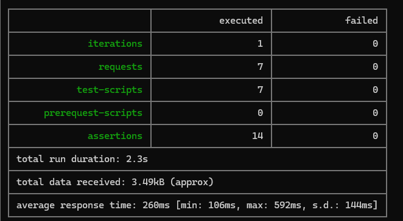
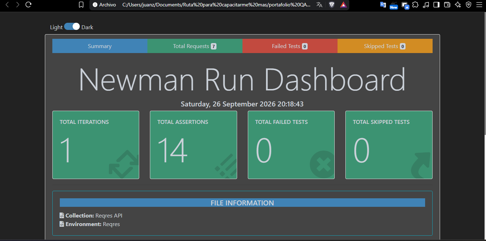

# Pruebas de API con Postman

Colección de Postman que prueba la API pública [reqres.in](https://reqres.in): inicio de sesión y consulta de usuarios. Cubre casos positivos y negativos, y cada caso lleva su descripción y sus verificaciones con `pm.test`.

Complementa las pruebas de interfaz de `04 - automatizacion-playwright`: aquella prueba lo que se ve en pantalla; esta prueba lo que responde el servidor.

**API bajo prueba:** `https://reqres.in/api`
**Herramienta:** Postman

---

## Qué hay en esta carpeta

| Archivo | Contenido |
|---|---|
| `Reqres API.postman_collection.json` | La colección: 7 requests y 14 tests |
| `Reqres.postman_environment.json` | El entorno con la variable `baseUrl` |

El entorno no contiene credenciales: `baseUrl` es una dirección pública. Las credenciales que usa el login (`eve.holt@reqres.in`) son los datos de demostración que publica el propio reqres.

---

## Qué cubre

Un request por caso de prueba, agrupados por recurso. Cada request tiene en su pestaña **Docs** el caso, la precondición y el resultado esperado.

| Carpeta | Caso | Resultado esperado | Tests |
|---|---|---|---|
| Auth | Login exitoso | 200 y un `token` en el cuerpo | 2 |
| Auth | Login sin password | 400 y un campo `error` | 2 |
| Auth | Login con usuario inexistente | 400 y `error: "user not found"` | 2 |
| Usuarios | Usuario existente (id 2) | 200 y los campos del usuario en `data` | 2 |
| Usuarios | Usuario inexistente (id 23) | 404 | 1 |
| Usuarios | Listar usuarios (`page=2`) | 200, paginación coherente y 6 usuarios | 3 |
| Usuarios | Listar usuarios, página fuera de rango (`page=3`) | 200 con `data` vacía (comportamiento observado) | 2 |

**7 requests, 14 tests.** Son cifras distintas porque un mismo request puede tener varias verificaciones.

**Última ejecución completa:** 26-sep-2026, con el Runner de Postman y el entorno `Reqres` — **14/14 en verde**, 0 errores, 3,4 s en total.

---

## Cómo usarla

1. En Postman, **Import** y seleccionar los dos archivos `.json` de esta carpeta.
2. Activar el entorno **Reqres** (desplegable de arriba a la derecha).
3. Ejecutar la colección con el **Runner** (`···` sobre la colección → **Run**) o cada request por separado con **Send**.

Todas las URLs usan `{{baseUrl}}`. Para probar contra otro ambiente basta con cambiar el valor de esa variable, sin tocar ningún request.

---

## Ejecución por consola con Newman

[Newman](https://www.npmjs.com/package/newman) corre la misma colección desde la terminal, sin abrir Postman. Es la forma en que un servidor de integración continua ejecuta pruebas de API.

```bash
npm install -g newman newman-reporter-htmlextra
cd "05 - pruebas-api"
newman run "Reqres API.postman_collection.json" -e "Reqres.postman_environment.json" -r "cli,htmlextra"
```

- `-e` indica el entorno contra el que se corre.
- `-r "cli,htmlextra"` muestra el resultado en consola y además genera un reporte HTML en la carpeta `newman/`. Esa carpeta no se sube al repositorio: los reportes se regeneran en cada corrida.
- Newman termina con código de salida `0` si todos los tests pasan y `1` si alguno falla. Ese código es el que usa un pipeline para marcar la ejecución en verde o en rojo.

**Corrida del 26-sep-2026:** 7 requests, 14 aserciones, 0 fallidas.




**Al leer una falla, primero se mira qué código llegó.** Un `429` (cuota agotada) o un error de red como `ENOTFOUND` hacen fallar las aserciones sin que haya un defecto en la API ni en las pruebas: es el entorno. Un `429` además no cuenta como request fallido, porque el servidor sí respondió; solo se ve en el detalle de cada aserción (`expected 200 but got 429`).

---

## Observaciones sobre la API

Lo que se notó al probar. reqres es una API de demostración, así que no se registran como defectos, pero sí como criterios que una API real debería cumplir:

- **Un solo código para todos los errores de login.** Un usuario que no existe devuelve `400`; una API real usaría `401` o `404`.
- **El `404` de un usuario inexistente llega con el cuerpo vacío**, sin mensaje que explique el error.
- **Página fuera de rango:** pedir `page=3` cuando solo hay 2 páginas devuelve `200` con `data` vacía, y el cuerpo indica `page: 3` aunque `total_pages` es 2. El test de este caso documenta el comportamiento actual, no un criterio de aceptación.
- **No valida contraseñas:** en una prueba manual, un email registrado con una contraseña incorrecta devolvió `200` con token. Por eso no hay un caso de "contraseña incorrecta".

---

## Limitación: cuota diaria

reqres.in limita el uso anónimo a **40 peticiones por día por dirección IP**, y el contador se reinicia a medianoche UTC. Al agotarlo responde `429`.

Por eso esta colección **no se ejecuta en el pipeline de integración continua**: un límite agotado produciría un fallo que no corresponde a un defecto ni de la API ni de las pruebas, sino del entorno. Una ejecución completa de la colección consume 7 de las 40 peticiones diarias.
